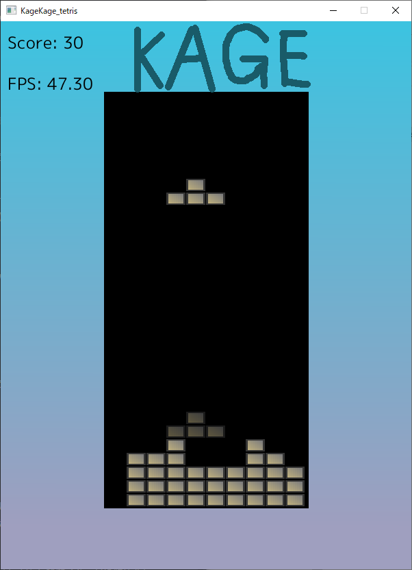

# KageKage_Tetris

# はじめに
これはシンプルなOSSテトリスライククローンゲームです。\
Go+Ebitenで書かれています。

# 特徴
* One バイナリ
* OSS、完全にフリー
* Discord Game Activityに対応

# 使い方
* 左右矢印キーで移動
* 上矢印キーで回転
* 下矢印キーで加速
* スペースでブロックを決定
* 中断はPキー
* Rキーでリセット
